# Douane Firewall - Architecture Documentation

This document provides detailed architectural diagrams and explanations of the Douane Firewall system.

## Table of Contents

- [System Overview](#system-overview)
- [Component Architecture](#component-architecture)
- [Data Flow](#data-flow)
- [Security Model](#security-model)
- [Threading Model](#threading-model)

## System Overview

Douane Firewall follows a **client-server architecture** with strict privilege separation between the root daemon and user-space GUI components.


## Component Architecture

### High-Level Component Diagram


### Module Dependencies


## Data Flow

### Packet Processing Flow


### GUI Communication Flow


## Security Model

### Privilege Separation


### Security Phases

Douane implements **5 security phases** for defense-in-depth:


### Trust Model


## Threading Model

### Daemon Threading Architecture


### Thread Safety

```mermaid
graph LR
    subgraph "Shared Resources"
        RULES[(Rules)]
        CONFIG[(Config)]
        PENDING[(Pending Decisions)]
    end

    subgraph "Thread 1: Packet Processor"
        T1_READ[Read Rules]
        T1_WRITE[Write Pending]
    end

    subgraph "Thread 2: GUI Handler"
        T2_READ[Read Pending]
        T2_WRITE[Write Rules]
    end

    T1_READ -->|Lock| RULES
    T1_WRITE -->|Lock| PENDING
    T2_READ -->|Lock| PENDING
    T2_WRITE -->|Lock| RULES

    RULES -.->|Protected by<br/>threading.Lock| LOCK1[🔒]
    CONFIG -.->|Protected by<br/>threading.Lock| LOCK2[🔒]
    PENDING -.->|Protected by<br/>threading.Lock| LOCK3[🔒]

    style RULES fill:#DDA0DD
    style CONFIG fill:#DDA0DD
    style PENDING fill:#DDA0DD
```



## Performance Considerations

### Packet Processing Pipeline


### Optimization Strategies

1. **Decision Caching**: Cache recent decisions for 60 seconds
2. **Service Whitelist**: Skip user prompts for known system services
3. **Rule Indexing**: Use hash maps for O(1) rule lookups
4. **Thread Pooling**: Reuse threads for GUI connections
5. **Lazy Loading**: Load rules on-demand, not at startup

## Deployment Architecture

### Single Host Deployment

```mermaid
graph TB
    subgraph "Linux Host"
        subgraph "User Session"
            GUI[GUI Client]
            TRAY[System Tray]
        end

        subgraph "System Services"
            DAEMON[Douane Daemon]
            SYSTEMD[systemd]
        end

        subgraph "Firewall Stack"
            UFW[UFW]
            IPTABLES[iptables]
            NETFILTER[Netfilter]
        end

        subgraph "Storage"
            RULES[/etc/douane/rules.json]
            CONFIG[/etc/douane/config.json]
            LOGS[/var/log/douane-daemon.log]
        end
    end

    SYSTEMD -->|Manages| DAEMON
    DAEMON -->|Reads/Writes| RULES
    DAEMON -->|Reads| CONFIG
    DAEMON -->|Writes| LOGS
    DAEMON -->|Integrates| UFW
    UFW -->|Configures| IPTABLES
    IPTABLES -->|Uses| NETFILTER
    GUI -->|Connects| DAEMON
    TRAY -->|Launches| GUI

    style DAEMON fill:#FFB6C1
    style GUI fill:#90EE90
```

---

## Further Reading

- [IMPLEMENTATION.md](IMPLEMENTATION.md) - Technical implementation details
- [CONTRIBUTING.md](CONTRIBUTING.md) - Development guidelines
- [README.md](README.md) - User documentation
- [FAQ.md](FAQ.md) - Frequently asked questions


