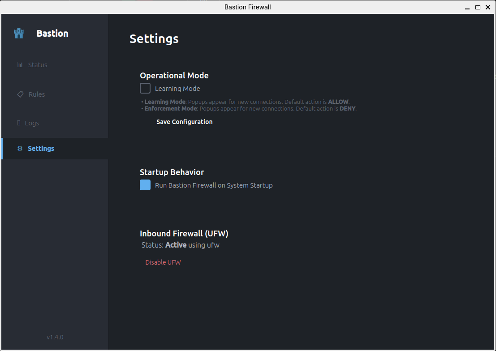

# Bastion Firewall

An application firewall for Linux that gives you control over outbound network connections.

[](https://github.com/shipdocs/bastion-firewall/releases/latest)
[](LICENSE)
[](https://github.com/shipdocs/bastion-firewall)



## Overview

Bastion intercepts outbound connections and prompts you to allow or deny them per application. It uses eBPF for kernel-level process identification and provides a Qt 6 interface for managing rules.

**Target Platform:** Zorin OS 18 / Ubuntu 24.04 LTS (Debian-based distributions)

## Features

- Real-time packet interception via iptables NFQUEUE
- eBPF-based process identification
- Qt 6 control panel with system tray integration
- Per-application rules stored in `/etc/bastion/rules.json`
- Learning mode for initial configuration
- UFW integration for inbound protection

## Installation

Download the latest `.deb` package from [Releases](https://github.com/shipdocs/bastion-firewall/releases) and install:

```bash
sudo dpkg -i bastion-firewall_*.deb
sudo apt-get install -f  # Install dependencies if needed
```

Or build from source:

```bash
git clone https://github.com/shipdocs/bastion-firewall.git
cd bastion-firewall
./build_deb.sh
sudo dpkg -i bastion-firewall_*.deb
```

### Development Setup

For development and testing:

```bash
git clone https://github.com/shipdocs/bastion-firewall.git
cd bastion-firewall

# Install dependencies
pip install -r requirements.txt

# Run tests
./run_tests.sh

# Or manually:
pip install -r test-requirements.txt
python -m pytest tests/
```

### Requirements

- Linux kernel 5.0+ with eBPF support
- Python 3.10+
- PyQt6
- BCC (eBPF toolkit)
- psutil>=5.9.0
- tabulate>=0.9.0
- NetfilterQueue>=1.1.0
- scapy>=2.5.0
- pystray>=0.19.0
- Pillow>=10.2.0

## Usage

Launch from the application menu or run:

```bash
bastion-gui
```

The system tray icon provides access to the control panel where you can:
- View and manage rules
- Switch between learning and enforcement modes
- Monitor connection logs

## Configuration

Configuration is stored in `/etc/bastion/config.json`:

```json
{
  "mode": "learning",
  "timeout_seconds": 30,
  "allow_localhost": true
}
```

### Onboarding flow

- **Learning mode** (default) allows outbound traffic while you review prompts and build rules. The daemon logs a warning and the GUI may show a banner/notification reminding you that traffic is permitted.
- To automatically switch to enforcement after a grace period, start the daemon with `--auto-enforce-after <seconds>` or set the environment variable:

  ```bash
  BASTION_AUTO_ENFORCE_AFTER=3600 bastion-daemon
  ```

  The daemon records the scheduled switch time to avoid repeated toggles and updates `/etc/bastion/config.json` when it transitions to enforcement.

## Architecture

```
┌─────────────────────────────────────────────┐
│  Outbound Connection                        │
│         ↓                                   │
│  iptables NFQUEUE                           │
│         ↓                                   │
│  ┌─────────────────────────────────────┐   │
│  │  Daemon (root)                      │   │
│  │  - Packet interception              │   │
│  │  - eBPF process identification      │   │
│  │  - Rule enforcement                 │   │
│  └──────────────┬──────────────────────┘   │
│                 │ Unix socket               │
│  ┌──────────────▼──────────────────────┐   │
│  │  GUI (user)                         │   │
│  │  - Connection prompts               │   │
│  │  - System tray                      │   │
│  └─────────────────────────────────────┘   │
└─────────────────────────────────────────────┘
```

## Uninstall

```bash
sudo dpkg --purge bastion-firewall
```

## Contributing

See [CONTRIBUTING.md](CONTRIBUTING.md) for development setup and guidelines.

## Development & Release

### automated Local Release
To create a new release (update versions, build packages, tag git, release on GitHub):
```bash
# 1. Update CHANGELOG.md with new notes
# 2. Run the release tool
./release_tool.sh 1.4.8
```
This requires `rpm` and `gh` CLI to be installed and authenticated.

## License


GPL-3.0. See [LICENSE](LICENSE) for details.
